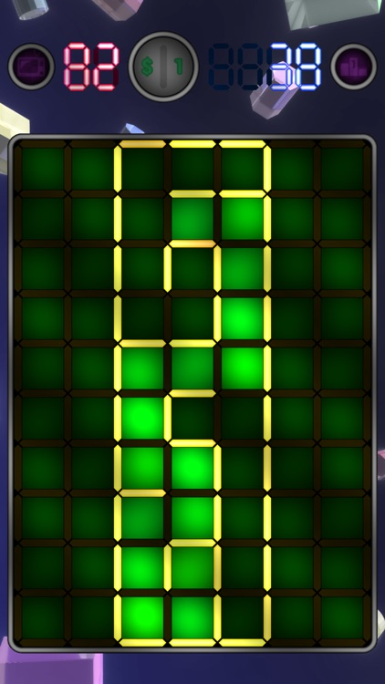
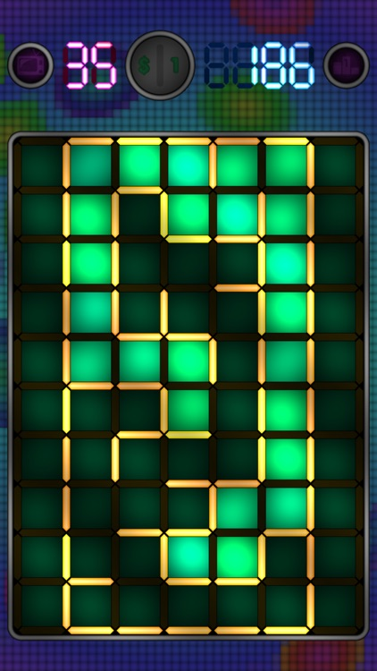
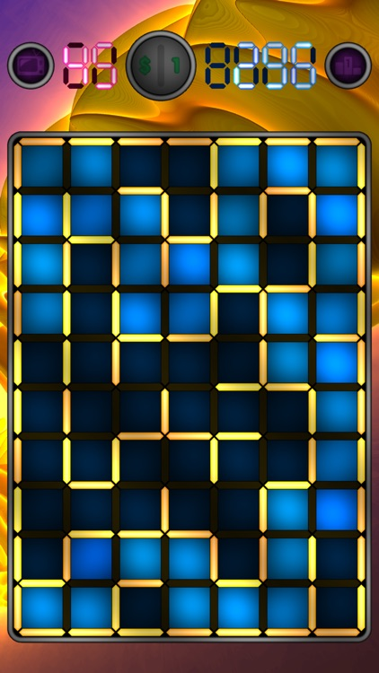
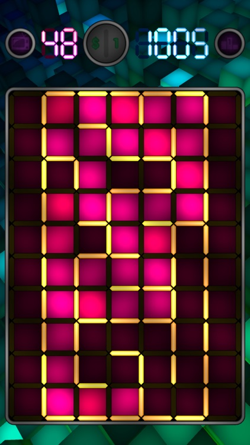
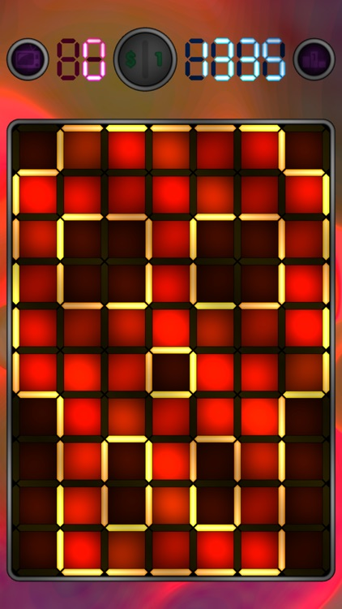

# Flamin Maze

## History

In February 2010, I released a simple game on the App Store named "Flamin Maze". It was a loose adaptation of an arcade redemption machine named "Flamin' Finger", from Namco, in which the player is challenged to draw a path in a maze as quickly as possible. The game remained available on the App Store until mid-2018, when I decided not to renew my Apple Developer membership (click [here](https://github.com/hknrx/FlaminStack/blob/master/README.md#history) to know why).

I originally developed this little game with Xcode - it was just as a hobby, made for the fun, and to experiment with a new social API that was just released at the time, "OpenFeint". But in September 2016, I got an email from Apple saying that they were in the process of cleaning up the App Store, and that all apps that haven't been updated for long will be removed. This meant that Flamin Maze would soon disappear, as its last update at that time was in January 2011 (I think the game was originally released for iOS 3.2 - we were now running iOS 10.1!). I could have simply let this game die - nobody would have cared -, yet, I saw an occasion to reuse the weird technical architecture which I made for my other game "[Flamin Stack](https://github.com/hknrx/FlaminStack)" in May of that same  year 2016, when I tested Unity Ads. Moreover, this was also the occasion to go a step further with this approach, and integrate many of the things which I developed for Shadertoy, making these demos available on iOS! And so, here was a new implementation of Flamin Maze, with fancy animated backgrounds, procedurally generated. Useless for most of the people, probably, but of some interest for my fellow developers, maybe?

The code shown here corresponds to the latest version, v2.1.2, that was made available on the App Store on November 8, 2017 (the old Xcode project can still be found [there](https://github.com/hknrx/Misc/tree/master/iOS/FlaminMaze)).

For those curious about technical details, the idea behind the game's display architecture is that instead of using classic sprites (textures) to render everything, almost all graphics are procedurally generated by fragment shaders, in runtime. In order to workaround the problem of GPU performances, both Flamin Maze and Flamin Stack automatically scale down the resolution depending on the frame rate, trading off quality for speed: the game is rendered to 2 RenderTextures which the size is a fraction of the screen size, even frames being rendered normally while odd frames are shifted by 0.5 pixel, then the last 2 frames are mixed together to display the game full screen. As I stated before, this technic is definitely not something that I would recommend for most games, as it creates many constraints and it can be a pain to model something solely using mathematic formulas, but this is quite fun and interesting to do! (...and it allows to render things that would be much harder to do using a more traditional approach, actually!).

## App Store description

> _Evil mazes, a timer, your finger: welcome to Flamin Maze!_
> 
> _Try to escape from as many levels as possible before the time runs out! Just draw a path with your finger from the entrance of each labyrinth to the exit hidden in the spot the furthest away! How far can you go?!_
> 
> _Dare compare your performances with other players on the Game Center, and attempt to unlock all achievements... if you can!_
> 
> _\* You like Flamin Maze? Make sure to also have a look to Flamin Stack! \*_
> 
> _(2010 Nicolas Robert)_

## Screenshots

